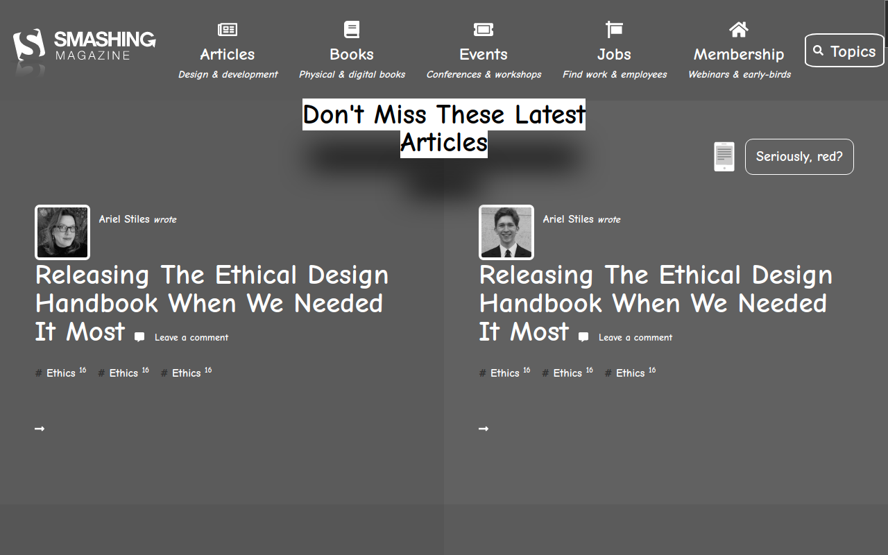

# Design Teardown - Heatmap of the Smash magazine homepage

> This project was to create a Heatmap of the smahing magazine homepage using grayscale coloring.

This project includes the following:

1.  Heatmap of the smashing magazine homepage.
2.  Grayscale colors identified with the help of online tools
3.  Elements aligned using flexbox, grid, and positioning

## Built With

- HTML5 & CSS
- Font Awesome Icons
- RGB Color to Grayscale online convertor

## Live Demo

[Live Demo Link](https://rawcdn.githack.com/Azeem838/smashing-magazine-heat-map/7c771058376cfa45574f2deb1c1789d3a76ef13a/index.html)

## Authors

👤 **Azeem Ahmed**

- Github: [@Azeem838](https://github.com/Azeem838)

👤 **Mikael Araya**

- Github: [@mikearaya](https://github.com/mikearaya)
- Twitter: [@mikearaya12](https://twitter.com/mikearaya12)
- Linkedin: [linkedin](https://linkedin.com/in/mikael-araya)

## 🤝 Contributing

Contributions, issues and feature requests are welcome!

Feel free to check the [issues page](https://github.com/Azeem838/smashing-magazine-heat-map/issues).

## Show your support

Give a ⭐️ if you like this project!

## 📝 License

This project is [MIT](lic.url) licensed.
